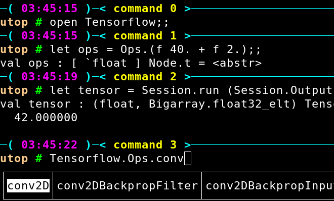

The __tensorflow-ocaml__ project provides some [OCaml](http://ocaml.org) bindings for [TensorFlow](http://tensorflow.org).

Experimental ocaml bindings for [PyTorch](https://pytorch.org)
can be found in the [ocaml-torch repo](https://github.com/LaurentMazare/ocaml-torch).

## Installation

Use [opam](https://opam.ocaml.org/) to install the __tensorflow-ocaml__ package.
Starting from version 0.0.11 this will automatically install the TensorFlow library.

```bash
opam install tensorflow
```

### Build a simple example or run utop

To build your first TensorFlow program, create a new directory and cd into it.
Then create a `forty_two.ml` file with the following content:

```ocaml
open Tensorflow

let () =
  let forty_two = Ops.(f 40. + f 2.) in
  let v = Session.run (Session.Output.scalar_float forty_two) in
  Printf.printf "%f\n%!" v
```

Then create a `dune` file with the following content:

```ocaml
(executables
  (names forty_two)
  (libraries tensorflow))
```

Run `dune build forty_two.exe` to compile the program and
`_build/default/forty_two.exe` to run it!

You can also use Tensorflow via utop.




### Optional step for GPU support

The TensorFlow library installed via opam does not support GPU acceleration.
In order to use your GPU you will have to install TensorFlow 1.14, either
by building it from source or by using prebuilt binaries. Then 
the library should be installed system-wide or you could set the
`LIBTENSORFLOW` environment variable.

```bash
    export LIBTENSORFLOW={path_to_folder_with_libtensorflow.so}
``` 

Possible ways to get the TensorFlow library:

* __Use prebuilt binaries from Google__. The releases are available for download in URLs of the form: `https://storage.googleapis.com/tensorflow/libtensorflow/libtensorflow-TYPE-OS-ARCH-VERSION.tar.gz`. For example:
    * CPU-only, Linux, x86_64.
    [[1.0.0]](https://storage.googleapis.com/tensorflow/libtensorflow/libtensorflow-cpu-linux-x86_64-1.0.0.tar.gz)
    [[1.14.0]](https://storage.googleapis.com/tensorflow/libtensorflow/libtensorflow-cpu-linux-x86_64-1.14.0.tar.gz)
    * GPU-enabled, Linux, x86_64.
    [[1.0.0]](https://storage.googleapis.com/tensorflow/libtensorflow/libtensorflow-gpu-linux-x86_64-1.0.0.tar.gz)
    [[1.14.0]](https://storage.googleapis.com/tensorflow/libtensorflow/libtensorflow-gpu-linux-x86_64-1.14.0.tar.gz)
    * CPU-only, OS X, x86_64.
    [[1.0.0]](https://storage.googleapis.com/tensorflow/libtensorflow/libtensorflow-cpu-darwin-x86_64-1.0.0.tar.gz)
    [[1.14.0]](https://storage.googleapis.com/tensorflow/libtensorflow/libtensorflow-cpu-darwin-x86_64-1.14.0.tar.gz)
    * GPU-enabled, OS X, x86_64.
    [[1.0.0]](https://storage.googleapis.com/tensorflow/libtensorflow/libtensorflow-gpu-darwin-x86_64-1.0.0.tar.gz)
    [[1.14.0]](https://storage.googleapis.com/tensorflow/libtensorflow/libtensorflow-gpu-darwin-x86_64-1.14.0.tar.gz)

* __Build the library from source__. Perform the following steps:
    1. Install the [Bazel build system](http://bazel.io/docs/install.html).
    1. Clone the TensorFlow repo:

        `git clone --recurse-submodules -b r1.14 https://github.com/tensorflow/tensorflow`
    1. Configure the build (you will be asked if you want to enable CUDA support):
    
        ```
        cd tensorflow/
        ./configure
        ```
    1. Compile the library:

       `bazel build -c opt tensorflow:libtensorflow.so`
       
       The binary should appear under `bazel-bin/tensorflow/libtensorflow.so`.

## Examples

__Tensorflow-ocaml__ includes two different APIs to write graphs.

### Using the Graph API

The graph API is very close to the original TensorFlow API.

* Some MNIST based tutorials are available in the [examples directory](https://github.com/LaurentMazare/tensorflow-ocaml/tree/master/examples/mnist).
  A simple Convolutional Neural Network can be defined as follows:
  ```ocaml
  let ys_ =
    O.Placeholder.to_node xs
    |> Layer.reshape ~shape:[ -1; 28; 28; 1 ]
    |> Layer.conv2d ~ksize:(5, 5) ~strides:(1, 1) ~output_dim:32
    |> Layer.max_pool ~ksize:(2, 2) ~strides:(2, 2)
    |> Layer.conv2d ~ksize:(5, 5) ~strides:(1, 1) ~output_dim:64
    |> Layer.max_pool ~ksize:(2, 2) ~strides:(2, 2)
    |> Layer.flatten
    |> Layer.linear ~output_dim:1024 ~activation:Relu
    |> O.dropout ~keep_prob:(O.Placeholder.to_node keep_prob)
    |> Layer.linear ~output_dim:10 ~activation:Softmax
  in
  ```

* `examples/load/load.ml` contains a simple example where the TensorFlow graph is loaded from a file (this graph has been generated by `examples/load.py`),
* `examples/basics` contains some curve fitting examples. You will need gnuplot to be installed via opam to run the gnuplot versions.

### Using the FNN API

The FNN API is a layer based API to easily build neural-networks. A linear classifier could be defined and trained in a couple lines:

```ocaml
  let input, input_id = Fnn.input ~shape:(D1 image_dim) in
  let model =
    Fnn.dense label_count input
    |> Fnn.softmax
    |> Fnn.Model.create Float
  in
  Fnn.Model.fit model
    ~loss:(Fnn.Loss.cross_entropy `mean)
    ~optimizer:(Fnn.Optimizer.gradient_descent ~learning_rate:8.)
    ~epochs
    ~input_id
    ~xs:train_images
    ~ys:train_labels;
```
A complete VGG-19 model can be defined as follows:

```ocaml
let vgg19 () =
  let block iter ~block_idx ~out_channels x =
    List.init iter ~f:Fn.id
    |> List.fold ~init:x ~f:(fun acc idx ->
      Fnn.conv2d () acc
        ~name:(sprintf "conv%d_%d" block_idx (idx+1))
        ~w_init:(`normal 0.1) ~filter:(3, 3) ~strides:(1, 1) ~padding:`same ~out_channels
      |> Fnn.relu)
    |> Fnn.max_pool ~filter:(2, 2) ~strides:(2, 2) ~padding:`same
  in
  let input, input_id = Fnn.input ~shape:(D3 (img_size, img_size, 3)) in
  let model =
    Fnn.reshape input ~shape:(D3 (img_size, img_size, 3))
    |> block 2 ~block_idx:1 ~out_channels:64
    |> block 2 ~block_idx:2 ~out_channels:128
    |> block 4 ~block_idx:3 ~out_channels:256
    |> block 4 ~block_idx:4 ~out_channels:512
    |> block 4 ~block_idx:5 ~out_channels:512
    |> Fnn.flatten
    |> Fnn.dense ~name:"fc6" ~w_init:(`normal 0.1) 4096
    |> Fnn.relu
    |> Fnn.dense ~name:"fc7" ~w_init:(`normal 0.1) 4096
    |> Fnn.relu
    |> Fnn.dense ~name:"fc8" ~w_init:(`normal 0.1) 1000
    |> Fnn.softmax
    |> Fnn.Model.create Float
  in
  input_id, model
```
This model is used in the [following example](https://github.com/LaurentMazare/tensorflow-ocaml/blob/master/examples/neural-style/vgg19.ml) to classify an input image. In order to use it you will have to download the [pre-trained weights](https://github.com/LaurentMazare/tensorflow-ocaml/releases/download/0.0.7/vgg19.cpkt).

There are also some MNIST based [examples](https://github.com/LaurentMazare/tensorflow-ocaml/tree/master/examples/fnn).

### Other Examples

The examples directory contains various models among which:

* A simplified version of
  [char-rnn](https://github.com/LaurentMazare/tensorflow-ocaml/blob/master/examples/char_rnn)
  illustrating character level language modeling using Recurrent Neural Networks.
* [Neural Style Transfer](https://github.com/LaurentMazare/tensorflow-ocaml/blob/master/examples/neural-style)
  applies the style of an image to the content of another image. This uses some deep Convolutional Neural Network.
* Some variants of [Generative Adversarial Networks](https://github.com/LaurentMazare/tensorflow-ocaml/blob/master/examples/gan).
  These are used to generate MNIST like images.

## Dependencies

* [dune](https://github.com/ocaml/dune) is used as a build system.
* [ocaml-ctypes](https://github.com/ocamllabs/ocaml-ctypes) is used for the C bindings.
* [Base](https://github.com/janestreet/base) is only necessary when generating the TensorFlow graph from OCaml, the wrapper itself does not need it.
* The code in the piqi directory comes from the [Piqi project](http://piqi.org). There is no need to install piqi though.
* [Cmdliner](https://github.com/dbuenzli/cmdliner) is used for command line interfaces.
* [Gnuplot-ocaml](https://bitbucket.org/ogu/gnuplot-ocaml) is an optional dependency used by a couple examples.
* [npy-ocaml](https://github.com/LaurentMazare/npy-ocaml) is used to read/write from npy/npz files.
