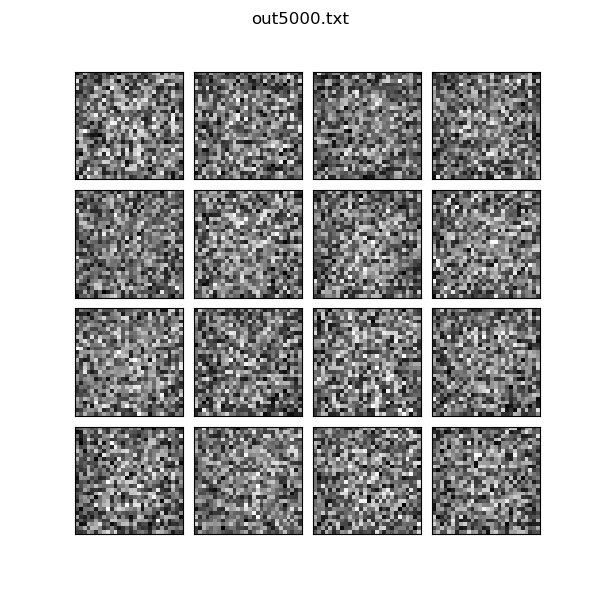
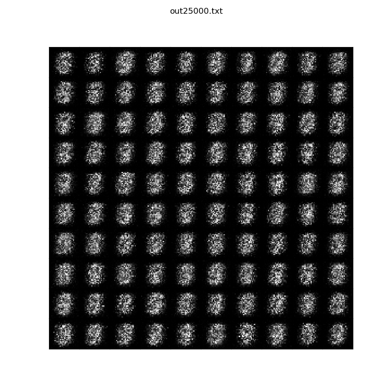

[Generative Adversarial Networks](https://en.wikipedia.org/wiki/Generative_adversarial_network)
(GAN) were introduced in 2014 by Goodfellow et al<sup>[1](#bib1)</sup>. 
These networks are generative models: after training a GAN on a dataset the goal
is to produce content very similar to what the original dataset holds.
A GAN is composed of two nets, a *Generator* and a *Discriminator*, that compete
against each other in a zero-sum game.

When considering an image dataset:

* The goal of the Generator is to produce an image that is difficult to
  distinguish from real dataset images. The Generator has access to vector of
  random noise called *latent space*. The Generator's output is called
  a *fake* image.
* The Discriminator takes as input an image, either fake or real, and has to
  output the probability with which it thinks the image is real.

During training the Discriminator gets better at recognizing fake images from
real which makes the task of the Generator more difficult so the Generator gets
better at producing realistic images. This in turns makes the task of the
Discriminator more difficult and so on.

# GANs applied to the MNIST dataset

In [mnist_gan.ml](https://github.com/LaurentMazare/tensorflow-ocaml/tree/master/examples/gan/mnist_gan.ml)
we use some simple GAN architecture to generate images similar to the MNIST dataset of hand written
digits.

Both the Generator and the Discriminator use a single hidden layer of 128 nodes.
The latent space has size 100. Leaky ReLU are used as an activation to make training more stable.
The output of the Generator goes through a tanh activation function so that it is normalized
between -1 and 1. Real MNIST images are also normalized between -1 and 1.

Note that the `create_generator` function takes a single input and returns the
model output as well as the variables used in the linear layer.
The `create_discriminator` function takes two inputs (fake and real) and
applies the same model to both inputs, using the same weights in linear layers.
Once again variables used in the model are returned.

```ocaml
let create_generator rand_input =
  let linear1 = Layer.Linear.create generator_hidden_nodes in
  let linear2 = Layer.Linear.create image_dim in
  let output =
    Layer.Linear.apply linear1 rand_input ~activation:(Leaky_relu 0.01)
    |> Layer.Linear.apply linear2 ~activation:Tanh
  in
  output, (Layer.Linear.vars linear1 @ Layer.Linear.vars linear2)

let create_discriminator xs1 xs2 =
  let linear1 = Layer.Linear.create discriminator_hidden_nodes in
  let linear2 = Layer.Linear.create 1 in
  let model xs =
    Layer.Linear.apply linear1 xs ~activation:(Leaky_relu 0.01)
    |> Layer.Linear.apply linear2 ~activation:Sigmoid
  in
  let ys1 = model xs1 in
  let ys2 = model xs2 in
  ys1, ys2, (Layer.Linear.vars linear1 @ Layer.Linear.vars linear2)
```

The Discriminator loss uses binary cross-entropy. Some smoothing is applied to the real label.
The Generator loss is based on the probability for the Discriminator to output 1 on
fake inputs.

```ocaml
let real_loss = O.binary_cross_entropy ~labels:(O.f 0.9) ~model_values:real_doutput in
let fake_loss = O.binary_cross_entropy ~labels:(O.f 0.) ~model_values:fake_doutput in
let discriminator_loss = O.(real_loss + fake_loss) in
let generator_loss = O.binary_cross_entropy ~labels:(O.f 1.) ~model_values:fake_doutput in
```

During each training step the Discriminator and Generator are trained independently.
Two optimizers are created, one of them applies to Discriminator variables, the
other to Generator variables.

```ocaml
let discriminator_opt =
  Optimizers.adam_minimizer ~learning_rate discriminator_loss
    ~varsf:discriminator_variables
in
let generator_opt =
  Optimizers.adam_minimizer ~learning_rate generator_loss ~varsf:gen_variables
in
```

The training loop then runs these two optimizers consecutively.
When optimizing the Discriminator both real and fake images are used. When
optimizing the Generator only fake images are used.
Each time some new random values are generated for the latent space.

```ocaml
for batch_idx = 1 to batches do
  let batch_images, _ = Mnist_helper.train_batch mnist ~batch_size ~batch_idx in
  let discriminator_loss =
    Tensor.fill_uniform batch_rand ~lower_bound:(-1.) ~upper_bound:1.;
    Session.run
      ~inputs:Session.Input.[
        float real_data_ph batch_images; float rand_data_ph batch_rand ]
      ~targets:discriminator_opt
      (Session.Output.scalar_float discriminator_loss)
  in
  let generator_loss =
    Tensor.fill_uniform batch_rand ~lower_bound:(-1.) ~upper_bound:1.;
    Session.run
      ~inputs:Session.Input.[ float rand_data_ph batch_rand ]
      ~targets:generator_opt
      (Session.Output.scalar_float generator_loss)
  in
  ...
```

We generate some output samples using the Generator at various points during training.
Note that we use the same random values for these sampled values during training
as it makes it easier to see progresses.



# Conditional GANs

The Conditional GAN (cGAN) architecture is a simple variant of the original
GAN, cGANs were presented by Mirza and Osindero in 2014<sup>[2](#bib2)</sup>.
In this setting both the Generator and Discriminator take as additional input
some annotations for which ground truth is available in the original dataset.
In the MNIST case this annotation is the digit class encoded as a one-hot
vector. For real images the actual label is used, for fake images both the
Discriminator and the Generator receive the same label. The Generator now has
to learn to produce realistic outputs conditional on a given label.

The same architecture is used as in the previous example.
[mnist_cgan.ml](https://github.com/LaurentMazare/tensorflow-ocaml/tree/master/examples/gan/mnist_cgan.ml)
uses cGANs to generate MNIST digits.

The gif below illustrates the progress made by the Generator in the training
process. Note that it is now easy to ask the Generator to produce images for
a given class.



# Bibliography
<a name="bib1">1</a>: 
Generative Adversarial Networks.
Ian J. Goodfellow, Jean Pouget-Abadie, Mehdi Mirza, Bing Xu, David Warde-Farley, Sherjil Ozair, Aaron Courville, Yoshua Bengio.
[arXiv:1406.2661](https://arxiv.org/abs/1406.2661) 2014.

<a name="bib2">1</a>: 
Conditional Generative Adversarial Nets.
Mehdi Mirza, Simon Osindero.
[arXiv:1411.1784](https://arxiv.org/abs/1411.1784) 2014.

